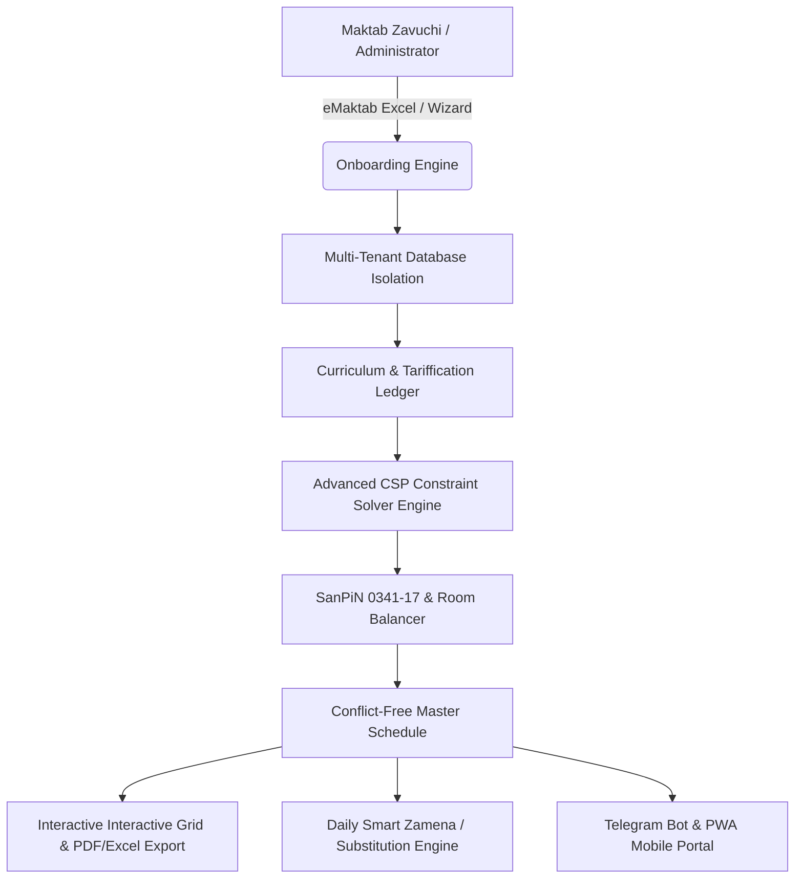

# 🚀 NEXT GEN SAAS: Universal Maktab Dars Jadvali Platformasi — Keng Qamrovli Texnik Topshiriq (Tech Spec / TZ)

> **Hujjat Versiyasi:** 2.0.0 (Enterprise Production Ready)  
> **Loyiha Nomi:** AI Lesson Table SaaS (Next Gen)  
> **Target Auditoriya:** O'zbekistondagi barcha 10,000+ umumta'lim, ixtisoslashtirilgan, xususiy va aralash maktablar  
> **Arxitektura Tipi:** Multi-tenant Cloud B2B SaaS (Next.js 15 App Router, TypeScript Strict, Tailwind CSS, PostgreSQL Neon, Prisma ORM, CSP AI Constraint Engine)

---

## 📌 1. Strategik Maqsad va Vizyon

Ushbu tizim shunchaki bitta 39-maktab uchun jadval tuzuvchi lokal dastur emas, balki O'zbekiston Respublikasi Maktabgacha va maktab ta'limi vazirligi (MMTV) standartlari, **SanPiN 0341-17** gigiyenik me'yorlari, **eMaktab (`emaktab.uz`)** tizimi integratsiyasi hamda xususiy/ixtisoslashgan maktablarning barcha talablariga 100% javob beradigan **Universal Multi-Tenant B2B SaaS platformasi** hisoblanadi.

Har qanday yangi maktab tizimga kirganida, **5 daqiqa ichida** o'zining eMaktab faylini yuklab, bitta ham to'qnashuvsiz, SanPiN qoidalariga to'liq mos keladigan dars jadvaliga ega bo'lishi shart.

---

## 🏛️ 2. Tizim Arxitekturasi va Asosiy Qatlamlar

---

## 🗺️ 3. Bosqichma-bosqich Yo'l Xaritasi (Step-by-Step Implementation Roadmap)

---

### 🟢 1-BOSQICH: Sehrli Onboarding va eMaktab 100% Avtomatizatsiyasi (Magic Onboarding)
*Maqsad: Yangi maktab ro'yxatdan o'tganda hech narsani qo'lda yozmasdan, 3 daqiqada butun maktab bazasini shakllantirish.*

- [ ] **1.1. Maktab Profili va O'quv Reja Shablonlari (School Presets):**
  - Maktab turini tanlash:
    * *Standart Davlat Maktabi* (2 smena, 6 kunlik, 1-4 sinflar 5 kunlik);
    * *Ixtisoslashtirilgan / Prezident Maktabi* (1 smena, chuqurlashtirilgan, to'liq kun 8:30–16:30);
    * *Xususiy Maktab* (5 kunlik, tushdan keyingi to'garaklar, o'zaro ovqatlanish va individual darslar);
    * *Rus / Qoraqalpoq / Tojik sinflari bor aralash maktab*.
- [ ] **1.2. Universal eMaktab Excel Parser (AI Sheet Detector):**
  - eMaktabdan olingan har qanday formatdagi darslar taqsimoti (Tarifikatsiya) faylini yuklash.
  - O'qituvchilar F.I.O, telefon raqami, biriktirilgan fanlar va sinflarni avtomatik o'qib, o'quv rejasini (curriculum) to'ldirish.
  - Barcha sinflar (`1-A` dan `11-B` gacha) va ularning smenalarini avtomatik ajratish.
- [ ] **1.3. O'qituvchilarning Rasmiy Metod Kunlarini Avto-Biriktirish:**
  - Fanlar bo'yicha vazirlikning 6 kunlik standarti (Dushanba: Boshlang'ich, Seshanba: Ona tili, Chorshanba: Aniq fanlar, Payshanba: Tabiiy fanlar, Juma: Xorijiy tillar, Shanba: Ijtimoiy fanlar) bo'yicha o'qituvchilarga dastlabki metod kunlarini avtomatik berish (zavuch xohlasa tahrirlay oladi).

---

### 🟡 2-BOSQICH: Guruhlarga Bo'linadigan Darslar Tizimi (Split Groups / Sub-Groups)
*Maqsad: Ingliz tili, Rus tili, Informatika va Texnologiya kabi 2 ta guruhga bo'linadigan darslarni mukammal boshqarish.*

- [ ] **2.1. Ma'lumotlar Bazasi va Tiplarni Kengaytirish:**
  - `Lesson` va `ClassSubject` modellariga:
    * `groupType`: `"WHOLE"` | `"GROUP_1"` | `"GROUP_2"` | `"BOYS"` | `"GIRLS"`
    * `groupId`: `string`
    * `pairedLessonId`: bog'langan parallel dars identifikatori.
- [ ] **2.2. O'qituvchilar va Xonalar Juftligi:**
  - Masalan, `9-A` sinfida Ingliz tili:
    * 1-guruh: *Karimova N.* (204-xona)
    * 2-guruh: *Aliyev B.* (205-xona)
  - Bir vaqtda, bitta sinfga 2 ta o'qituvchi kirishini konflikt hisoblamaslik, balki parallel sub-dars sifatida vizual ko'rsatish (katakchani 2 qismga ajratish: `G1 / G2`).
- [ ] **2.3. CSP Algoritmida Guruh Cheklovi:**
  - Guruh darslari faqat va faqat bir vaqtda (parallel) qo'yilishi shart. 1-guruh boshqa kuni, 2-guruh boshqa kuni o'tilishi qat'iyan taqiqlanadi.

---

### 🟠 3-BOSQICH: Xonalar va Resurslar Fondi Balansiri (Room & Capacity Balancer)
*Maqsad: Maktabdagi sport zal, kompyuter xonasi va laboratoriyalar to'qnashuvini 0 ga tushirish.*

- [ ] **3.1. Ixtisoslashgan Xonalar Turlari:**
  - Sport zali (Sig'imi: bir vaqtda ko'pi bilan 1 yoki 2 ta sinf);
  - Informatika xonalari (Kompyuter sinfi 1, Kompyuter sinfi 2);
  - Kimyo / Fizika laboratoriyalari;
  - Texnologiya ustaxonasi / Oshxona.
- [ ] **3.2. Resurslar Bo'yicha Qat'iy Cheklov (Hard Constraint):**
  - CSP Solver dars qo'yayotganda xonaning bandligini tekshiradi. Bir vaqtda mavjud zallar sonidan ortiq sinfga Jismoniy tarbiya qo'yilmaydi.
- [ ] **3.3. Sinf Xonalarining "Biriktirilganligi" (Homeroom Classrooms):**
  - Boshlang'ich sinflar (`1-4` sinflar) kabinetdan-kabinetga ko'chmaydi — ular o'zlarining doimiy xonasida o'tiradi, o'qituvchilar ularning oldiga keladi.
  - Yuqori sinflar kabinet tizimi bo'yicha xonalarni almashtiradi.

---

### 🔵 4-BOSQICH: SanPiN 0341-17 Gigiyenik Intellekti (Haftalik Aqliy To'lqin)
*Maqsad: O'quvchilar aqliy charchamasligi uchun darslarni tibbiy-pedagogik me'yorlar asosida joylashtirish.*

- [ ] **4.1. Fanlarning Qiyinlik Ballari Shkalasi (Difficulty Scale 1–10):**
  - *Matematika, Algebra, Geometriya, Fizika, Kimyo:* 9–10 ball
  - *Ona tili, Adabiyot, Chet tili, Biologiya:* 7–8 ball
  - *Tarix, Geografiya, Informatika:* 5–6 ball
  - *Musiqa, Tasviriy san'at, Texnologiya, Tarbiya, Jismoniy tarbiya:* 2–4 ball
- [ ] **4.2. Kunlik Yuklama Egri Chizig'i (Workload Curve):**
  - Dushanba: O'rtacha yuklama (haftaga kirishish);
  - Seshanba va Chorshanba: Eng yuqori aqliy yuklama cho'qqisi;
  - Payshanba: O'rtacha tushish;
  - Juma va Shanba: Yengil yakunlash.
- [ ] **4.3. Kun Ichida Soatlar Taqsimoti:**
  - 1-2-darslar: Fikrni jamlash va og'ir fanlar;
  - 3-4-darslar: O'rtacha fanlar;
  - 5-6-darslar: Jismoniy faollik, san'at va mehnat fanlari. Jismoniy tarbiya darsi hech qachon 1-soatga qo'yilmaydi.

---

### 🟣 5-BOSQICH: O'qituvchilar Uchun "Darchasiz Jadval" (Zero Windows / Compact Schedule)
*Maqsad: O'qituvchilarning darslari orasida 2-3 soatlik bo'sh "darchalar" (okno) bo'lmasligini ta'minlash.*

- [ ] **5.1. Darcha Jarimasi (Window Penalty Heuristic):**
  - CSP Solver darslarni qo'yishda o'qituvchining kunlik darslarini ixcham (ketma-ket) to'playdi.
  - Agar o'qituvchining 1-darsi va 4-darsi bo'lsa (o'rtada 2 soat oyna), solver ushbu holatga yuqori jarima balli beradi va darslarni 1-2-3 qilib siqishtiradi.
- [ ] **5.2. Smena Izolyatsiyasi:**
  - 1-smenada darsi bor o'qituvchi tushdan keyin bo'shatiladi.
  - Agar o'qituvchi ikkala smenada ham dars o'tadigan bo'lsa (kamdan-kam hollarda), smenalar orasidagi tanaffus hisobga olinadi.

---

### 🔴 6-BOSQICH: Smart Zamena Tizimi (Real-Time Teacher Substitution Engine)
*Maqsad: O'qituvchi to'satdan kasal bo'lib qolsa, zavuch 10 soniyada o'rniga boshqa o'qituvchini topishi va buyruq chiqarishi.*

- [ ] **6.1. Bir Bosishda "O'qituvchi Kelmadi" Belgilash:**
  - Zavuch o'qituvchi profilida "Bugun kelmadi" (kasal, xizmat safari, shaxsiy sabab) tugmasini bosadi.
- [ ] **6.2. AI Zamena Tavsiya Algoritmi:**
  - Tizim shu kuni, shu soatlarda bo'sh bo'lgan, aynan shu fandan yoki turdosh fandan dars o'tuvchi o'qituvchilarni filtrlab, eng mos nomzodlarni reyting bo'yicha ko'rsatadi.
- [ ] **6.3. Rasmiy "Zamena Daftari" (Eksport va Hisobot):**
  - Oylik tabelga tushadigan soatlik almashtirish hisoboti va kunlik e'lonlar doskasi uchun tayyor PDF chop etish.

---

### ⚪ 7-BOSQICH: Enterprise Multi-Tenant & RBAC Xavfsizlik
*Maqsad: Har bir maktab boshqa maktabning ma'lumotlarini ko'ra olmasligi, o'ta xavfsiz va tezkor ishlash.*

- [ ] **7.1. Strict Multi-Tenancy:**
  - Har bir jadval, so'rov va prisma transaksiyasida `schoolId` izolatsiyasi.
  - Ruxsatsiz kirish (IDOR) xavfsizligi.
- [ ] **7.2. Rolli Ruxsatlar Tizimi (RBAC):**
  - `SUPER_ADMIN`: Butun SaaS boshqaruvi, yangi maktab ochish, to'lovlar va billing nazorati.
  - `SCHOOL_DIRECTOR`: Maktab hisobotlari, tahlillar va yakuniy jadvalni tasdiqlash.
  - `SCHOOL_ZAVUCH`: Jadval yaratuvchi, tahrirlovchi, zamenani boshqaruvchi asosiy operator.
  - `TEACHER` (Shaxsiy kabinet / Telegram Bot): Faqat o'zining shaxsiy dars jadvali, o'zgarishlar va zamenalarni ko'radi.
  - `STUDENT / PARENT`: Sinfning dars jadvali va o'zgarishlarini ochiq ko'rish (Read-Only).
- [ ] **7.3. O'zbekiston Fintech Integratsiyalari (Billing & SaaS Monetization):**
  - Click va Payme Merchant integratsiyasi;
  - Maktablar uchun yillik / yarim yillik obuna tariflari (Oddiy, Pro, Enterprise);
  - Avtomatlashtirilgan hisob-faktura (Didox orqali e-faktura).

---

## 📊 4. Me'yoriy Talablar va Cheklovlar Matritsasi

| Cheklov Turi | Qoida Tavsifi | Jazo / Qat'iylik Darajasi |
|---|---|---|
| **O'qituvchi Kolliziyasi** | Bitta o'qituvchi bir vaqtda faqat 1 ta xonada bo'lishi mumkin | ❌ **Qat'iy taqiq (CRITICAL / 0 ta xato)** |
| **Metod Kuni** | O'qituvchining belgilangan metod kunida dars qo'yilmaydi | ❌ **Qat'iy taqiq (CRITICAL / 0 ta xato)** |
| **Boshlang'ich Shanba** | 1–4 sinflar Shanba kuni dars o'tmaydi (5 kunlik ta'lim) | ❌ **Qat'iy taqiq (CRITICAL / 0 ta xato)** |
| **Boshlang'ich Fan Takrori** | 1–4 sinflarda bir fandan kuniga faqat 1 soat dars | ❌ **Qat'iy taqiq (SanPiN 0341-17)** |
| **Ixtisoslashgan Xona** | Sport zal / Kompyuter xonasi sig'imidan ortiq dars qo'yilmaydi | ❌ **Qat'iy taqiq (Resurs chegarasi)** |
| **Guruhli Darslar** | 1-guruh va 2-guruh darslari parallel bitta soatda o'tilishi shart | ❌ **Qat'iy taqiq (Parallel bo'lishi shart)** |
| **O'qituvchi Darchalari** | O'qituvchining darslari orasida bo'sh soat (okno) qoldirmaslik | ⚠️ *Yumshoq optimizatsiya (Soft Constraint)* |
| **Aqliy Yuklama Shkalasi** | Seshanba-Chorshanba eng og'ir fanlar, Juma yengil fanlar | ⚠️ *Yumshoq optimizatsiya (SanPiN tavsiyasi)* |

---

## 🛠️ 5. Texnik Stack va Arxitektura

* **Frontend:** Next.js 15 (App Router), React 19, TypeScript Strict Mode, Tailwind CSS v4, Lucide Icons, Framer Motion animatsiyalari.
* **Backend:** Next.js Server Actions, REST Route Handlers, Edge Middleware.
* **Database & ORM:** Neon Serverless PostgreSQL, Prisma ORM (v6).
* **Algoritmik Dvigatel:** CSP (Constraint Satisfaction Problem) Solver + MRV (Minimum Remaining Values) + LCV (Least Constraining Value) Heuristics + Arc Consistency (AC-3).
* **Eksport Dvigateli:** ExcelJS (Rangli rasmiy format), jsPDF / Puppeteer (Chop etishga tayyor A3/A4 varaqlar).
* **Kesh va Sinxronizatsiya:** Optimistic UI + PWA Offline Kesh + Background Sync.

---

## ✅ 6. Qabul Qilish Mezonlari (Acceptance Criteria & Definition of Done)

1. Har qanday yangi maktab eMaktab Excel faylini yuklaganda, **30 soniya ichida** barcha 30–60 sinf va 50–100 o'qituvchilar tizimga tushadi.
2. "AI orqali yaratish" bosilganda:
   * **O'qituvchi kolliziyalari:** 0 ta;
   * **Metod kuni buzilishlari:** 0 ta;
   * **Xonalar to'qnashuvi:** 0 ta;
   * **SanPiN xatoliklari:** 0 ta.
3. Dars jadvali O'zbekiston maktablaridagi rasmiy 39-maktab formati kabi A3/A4 formatda chop etishga tayyor holatda eksport bo'ladi.
4. O'qituvchilar bo'sh/band vaqtlari bir bosishda avtomatik saqlanadi.
