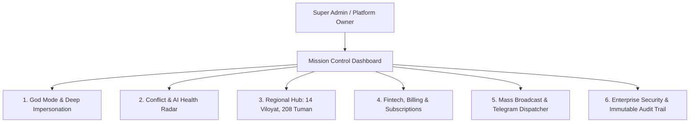

# ⚡ SUPER ADMIN MEGA COMMAND CENTER: Enterprise Platform Boshqaruv Markazi — Texnik Topshiriq (Tech Spec / TZ)

> **Hujjat Versiyasi:** 2.0.0 (Enterprise Production Architecture)  
> **Modul Nomi:** Super Admin Mission Control (Mega Panel)  
> **Loyiha:** AI Lesson Table SaaS (Next Gen)  
> **Maqsad:** O'zbekiston miqyosidagi 10,000+ maktablar, yuz minglab o'qituvchilar, millionlab o'quvchilar va milliardlab so'mlik SaaS billing oqimlarini bitta markazlashgan ekrandan boshqarish.

---

## 🏛️ 1. Me'moriy Vizyon va Panellar Xaritasi

Super Admin Mega Panel oddiy statistika ko'rsatuvchi sahifa emas, balki **"Avtomatlashtirilgan Dispetcherlik & Boshqaruv Markazi" (Mission Control)** hisoblanadi.



---

## 🗺️ 2. Bosqichma-bosqich Amaliy Qadamlar (Step-by-Step Implementation Roadmap)

---

### 🟢 1-FAZA: "God Mode" & Deep Tenant Impersonation (Bir Bosishda Maktabga Kirish)
*Zavuch yoki direktor qo'ng'iroq qilib yordam so'raganida, 1 soniyada ularning ekraniga kirish va muammoni bartaraf etish.*

- [ ] **1.1. Xavfsiz Impersonation Sessiyasi:**
  - Super admin o'z akkauntidan chiqmasdan, istalgan maktab ID si bo'yicha "Zavuch sifatida kirish" tugmasini bosadi.
  - Tizim JWT tokenda `impersonatedBy: super_admin_id` belgisini qo'yadi.
- [ ] **1.2. Vizual "God Mode" Bar (Banner):**
  - Ekranning yuqori qismida doimiy ko'rinib turuvchi yorqin ogohlantirish paneli:
    * `"Siz hozir 39-maktab boshqaruvidasiz (Zavuch rejimi). [Super Adminga qaytish ↩]"`
- [ ] **1.3. Harakatlar Cheklovi (Action Guardrails):**
  - Impersonation rejimida xavfli harakatlar (maktabni o'chirish, boshqa admin parolini o'zgartirish) bloklanadi, faqat jadval tuzish, o'qituvchilar sozlamasi va audit imkoni beriladi.

---

### 🟡 2-FAZA: Ziddiyatlar va AI Holati Jonli Radari (Real-Time Conflict Radar)
*Qaysi maktabda jadval tuzish qiyinlashganini va server yuklamasini real vaqtda kuzatish.*

- [ ] **2.1. Maktablar Jadvallari Holati Matritsasi:**
  - **Yashil (Ideal):** 0 ta ziddiyat, darslar to'liq taqsimlangan (100%);
  - **Sariq (Jarayonda):** 1–10 ta kichik ziddiyat yoki to'liq taqsimlanmagan darslar;
  - **Qizil (Kritik yordam kerak):** 10+ o'qituvchilar to'qnashuvi yoki metod kuni buzilishlari (masalan: *"39-maktab: 100 ta ziddiyat"*).
- [ ] **2.2. Bir Bosishda "Avto-Diagnostika":**
  - Super admin maktab profilini ochmasdan ham bitta tugma bilan ushbu maktabdagi eng asosiy 3 ta muammoni ko'ra oladi (masalan: *"251 soat taqsimlanmagan, 10 ta o'qituvchida ortiqcha nagruzka"*).
- [ ] **2.3. AI Solver Performance Metrikalari:**
  - Serverdagi CSP Solver ning o'rtacha ishlash vaqti (ms);
  - Neon PostgreSQL serverless bazasining xotira va tranzaksiyalar yuki;
  - Kesh urilish foizi (Cache hit ratio).

---

### 🟠 3-FAZA: Hududiy Hub (14 Viloyat, 208 Tuman va RayONO Boshqaruvi)
*O'zbekistonning barcha maktablarini geografik va ma'muriy tartibda guruhlash.*

- [ ] **3.1. Ma'muriy Ierarxiya:**
  - `Viloyat` -> `Tuman / Shahar` -> `Maktablar ro'yxati`.
  - Har bir viloyat bo'yicha tezkor statistika:
    * Toshkent shahri: 340 ta maktab (Faol: 120 ta);
    * Samarqand viloyati: 1,250 ta maktab (Faol: 310 ta);
    * Farg'ona viloyati: 980 ta maktab (Faol: 240 ta).
- [ ] **3.2. RayONO / OblONO Tahliliy Kabineti:**
  - Tuman maktabgacha va maktab ta'limi bo'limi mudiri uchun "faqat o'z tumanidagi maktablar monitoringi"ni ko'rish imkoniyati (Read-Only tahlil).
- [ ] **3.3. Xaritalash va Filtrlash:**
  - Interaktiv filtrlar: Viloyat, Tuman, Smenalar soni (1-smena / 2-smena), Ta'lim tili (O'zbek, Rus, Qoraqalpoq), Maktab tipi (Umumiy, Ixtisos, Xususiy).

---

### 🔵 4-FAZA: Fintech, Billing va Obunalar Markazi (SaaS Monetization Engine)
*Maktablardan tushadigan tushumlar, litsenziyalar, shartnomalar va avtomatik hisob-kitob.*

- [ ] **4.1. Tariflar Matritsasi:**
  - **Trial (Bepul sinov):** 14 kun, 1 ta maktab, asosiy funksiyalar;
  - **Standart (Kichik maktablar):** 1 smenali, 20 tagacha sinf;
  - **Pro (Katta umumta'lim maktabi):** 2 smenali, cheksiz sinf va o'qituvchilar, AI Smart Zamena moduli;
  - **Enterprise (Tuman / Viloyat shartnomasi yoki Xususiy maktablar):** Shaxsiy domen, cheksiz filsegmentlar, ustuvor AI quvvati, 24/7 VIP qo'llab-quvvatlash.
- [ ] **4.2. Mahalliy To'lov Shlyuzlari Integratsiyasi:**
  - Click Merchant API (Auto-Debit / Bir martalik to'lov);
  - Payme Business API;
  - Uzum Bank Business;
  - Didox.uz integratsiyasi (Elektron hisob-fakturalarni avtomatik shakllantirish va yuborish).
- [ ] **4.3. Avtomatlashtirilgan Dunning Tizimi (Muddati Tugash Ogohlantirishlari):**
  - Obuna tugashiga 7 kun, 3 kun va 1 kun qolganda direktor va zavuchning telefoniga SMS va Telegram orqali xabarnoma.
  - To'lov qilinmaganda cheklangan rejimga (ReadOnly) avtomatik o'tkazish.

---

### 🟣 5-FAZA: Ommaviy Xabarnomalar va Telegram Dispatcher (Broadcast Engine)
*10,000 ta maktab rahbarlariga bir zumda muhim yangiliklar va eslatmalarni yetkazish.*

- [ ] **5.1. Tizimli In-App Modal va Bannerlar:**
  - Masalan: *"25-avgustgacha barcha maktablar yangi o'quv rejasini tasdiqlashi shart"* degan tizimli banner.
  - Zavuchlar tizimga kirganida o'qib, "Tushundim" deb tasdiqlashi shart bo'lgan modal xabarlar.
- [ ] **5.2. Telegram Bot Broadcast:**
  - Barcha ulangan zavuch va direktorlarga rasmiy bot orqali rasmli va tugmali xabarlar yuborish.
  - Segmentatsiya bo'yicha yuborish: *"Faqat 2-smenali maktablarga"*, *"Faqat Toshkent shahridagi maktablarga"*.

---

### 🔴 6-FAZA: Enterprise Xavfsizlik va Immutabil Audit Jurnali (Audit & Security Trail)
*Barcha harakatlarni sekundigacha qayd etish va xavfsizlikni kafolatlash.*

- [ ] **6.1. Har Bir Harakatning "Qora Qutisi" (Immutable Log):**
  - Qaysi admin, qaysi IP-manzildan, qaysi maktabni yaratdi, tahrirladi yoki statusini o'zgartirdi.
  - Kim qachon kimning jadvalini generatsiya qildi yoki o'chirdi.
- [ ] **6.2. Zaxira Nusxalash va Tiklash (Backup & Restore per School):**
  - Bitta maktabning butun jadvalini 1 bosishda zaxiraga olish (JSON Snapshot) va zarurat bo'lganda 1 soniyada oldingi holatiga qaytarish (Rollback).
- [ ] **6.3. Anti-Brute Force va Shubhali Kirishlar Blokirovkasi:**
  - Ketma-ket 5 marta noto'g'ri parol tergan IP larni avtomatik bloklash.
  - 2FA (Ikki bosqichli autentifikatsiya) Super Adminlar uchun majburiy bo'lishi.

---

## 🗄️ 3. Ma'lumotlar Bazasi Modeli (Prisma Schema Additions)

Ushbu kengaytirilgan funksionallik uchun `prisma/schema.prisma` ga quyidagi jadvallar qo'shiladi:

```prisma
// Maktab Obunalari va Billing Tarixi
model SchoolSubscription {
  id              String        @id @default(cuid())
  schoolId        String        @unique
  school          School        @relation(fields: [schoolId], references: [id], onDelete: Cascade)
  plan            String        @default("TRIAL") // TRIAL, STANDARD, PRO, ENTERPRISE
  status          String        @default("ACTIVE") // ACTIVE, EXPIRED, CANCELLED, PENDING
  billingCycle    String        @default("ANNUAL") // MONTHLY, ANNUAL, LIFETIME
  amount          Decimal       @default(0.00)
  currency        String        @default("UZS")
  startedAt       DateTime      @default(now())
  expiresAt       DateTime
  autoRenew       Boolean       @default(false)
  contractNumber  String?
  didoxDocId      String?
  createdAt       DateTime      @default(now())
  updatedAt       DateTime      @updatedAt

  @@index([status, expiresAt])
}

// Tizim Audit Qaydnomasi
model AuditLog {
  id            String      @id @default(cuid())
  userId        String?
  userEmail     String?
  role          String?
  schoolId      String?
  action        String      // CREATE_SCHOOL, IMPERSONATE, GENERATE_SCHEDULE, DELETE_CLASS
  details       String      // Matnli yoki JSON tavsif
  ipAddress     String?
  userAgent     String?
  createdAt     DateTime    @default(now())

  @@index([schoolId, createdAt])
  @@index([action, createdAt])
}

// Ommaviy Xabarnomalar
model SystemBroadcast {
  id            String      @id @default(cuid())
  title         String
  content       String
  severity      String      @default("INFO") // INFO, WARNING, CRITICAL
  targetRegion  String?     // NULL bo'lsa barcha viloyatlar
  targetPlan    String?     // NULL bo'lsa barcha tariflar
  startsAt      DateTime    @default(now())
  expiresAt     DateTime?
  isActive      Boolean     @default(true)
  createdBy     String
  createdAt     DateTime    @default(now())
}
```

---

## 💻 4. Super Admin UI/UX Standartlari

1. **Dizayn Estetikasi:** Dark Navy / Slate-950 Enterprise palitrasi, Oltin (`amber-400/500`) va Safir (`indigo-500/600`) aksentlari, shaffof Glassmorphism fonlar.
2. **Katta Monitorlarga Moslashuv (Widescreen 1920px+):**
   - Ekranning har ikki tomonidagi bo'sh joylarni isrof qilmasdan, 4–5 ustunli ko'rsatkichlar va jonli jadvallar bilan to'liq qoplash.
3. **Klaviatura Tezkor Tugmalari (Hotkeys):**
   - `Ctrl + K` / `Cmd + K`: Global qidiruv (Istalgan maktab, direktor yoki zavuchni 1 soniyada topish).
   - `Esc`: Modallarni yopish yoki Impersonation rejimidan zudlik bilan chiqish.

---

## ✅ 5. Qabul Qilish Mezonlari (Definition of Done)

1. Super Admin o'tirgan joyida bitta tugma bilan istalgan maktabning ichiga kirib, ularning dars jadvalini to'g'irlab bera oladi (**God Mode 100% ishlaydi**).
2. Qaysi maktabda qancha ziddiyat borligi Super Admin bosh sahifasida qizil / yashil indikatorlar bilan ko'rinib turadi.
3. Maktablarni viloyat va tumanlar bo'yicha saralash 0.2 soniyada amalga oshadi.
4. Barcha maktablarga umumiy bildirishnoma yuborish imkoni mavjud.
5. Har bir muhim harakat `AuditLog` ga muhrlanadi.
